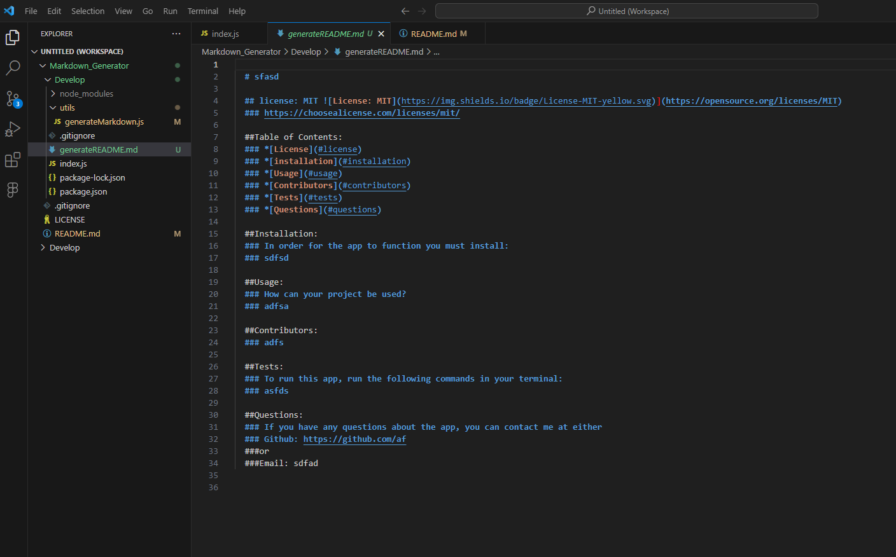

# Project Name: Markdown_Generator
Albert Aleman
Github Repository: https://github.com/aalemanyz67/Markdown_Generator
Application video Link:https://drive.google.com/file/d/1WAG-blNEPRMr-OcKmPWbDLgAGWcSXT81/view?usp=sharing

Using Node.js create a markdown generator to output a README.md file with the user input.
This application was built to demonstrate the skills that I have been learning over node.js.
The objective of this application was to take in the input from a user and then generate a README.md file.
Throughout this project I learned how to incorporate various skills such as the writeToFile, writeFile, module.export, incorporating packages, downloading and installing packages, and using the render function among many other skills.

## Istallation

In order for this application to work properly the following must be done.
Ensure you are using VS Code to open up the application. 2. Once opened, select the index.js file that is located within the "Develop folder and right click. 3. select the "open in intergrated terminal" feature. 4. Insure that your system is ready to go by typing "npm i" to make sure you have the needed packages. 5. After confirming you have the needed packages, type "node index.js" and follow the pormpted question in the terminal. 6. Finally when all prompts have been filled the application will generate and new markdown file for you the user. 

## Usage and Screen Shots
This application can be used by a user to generate a professional README.md file. Bellow are some images of the application in action.

Once in VS Code select the index.js file and open in terminal. Intall needed packages.

Image of completed package download.

Type node index.js to run application.

Image shows questions being answered by user.

README.md file is generated.

## Colaborators and Resources
No other Colaborators.

Resources:
VS Code
Node.js
### Licences and Badges:
Apache 2.0: https://www.apache.org/licenses/LICENSE-2.0
Mit: https://choosealicense.com/licenses/mit/
Eclipse Public Foundation 1.0: https://projects.eclipse.org/license/EPL-1.0
Github documentation for license badges:https://gist.github.com/lukas-h/2a5d00690736b4c3a7ba
inquirer package documentation:https://www.npmjs.com/package/inquirer
writeFile assistance and documentation: https://nodejs.dev/en/learn/writing-files-with-nodejs/

### Website for issue troubleshooting:
https://bobbyhadz.com/blog/the-cb-argument-must-be-of-type-function-received-undefined

## License: MIT
https://choosealicense.com/licenses/mit/

